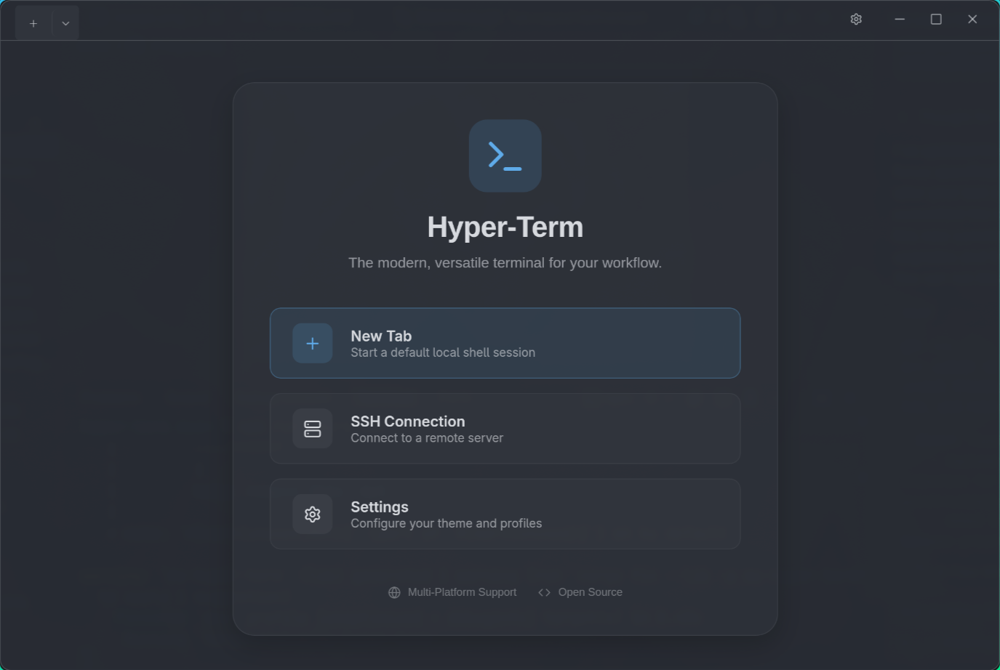

# 🚀 Hyper Term (Tauri + React)

A modern, GPU-accelerated terminal emulator built with **Rust (Tauri)** and **React**.
Designed to be lightweight, incredibly fast, and aesthetically pleasing with a "Ghostty-style" translucent UI.



## ✨ Features

* **⚡ Blazing Fast:** Powered by Rust and `portable-pty` for the backend, with `xterm.js` WebGL rendering on the frontend.
* **🎨 Modern UI:** Sleek, borderless design with a custom title bar and glassmorphism accents.
* **🔀 Multi-Tab & Split Support:** Manage multiple sessions effortlessly.
* **📁 Smart Profile Selector:** Dropdown to easily switch between **Bash**, **WSL**, **PowerShell**, or **CMD** based on your OS.
* **🏠 Welcome Hub:** A premium landing page that appears when all tabs are closed, providing quick actions for new sessions.
* **🏠 Global Theming:** Choose from popular presets (Dracula, Nord, etc.) that apply instantly to the entire application UI.
* **🌐 SSH Profile Manager:** Complete CRUD operations for SSH profiles with live UI updates and persistence.
* **📏 Responsive Tabs:** Chrome-like tab behavior with equal width distribution and graceful shrinking.
* **⚙️ Dynamic Settings:** Manage appearance and profiles through a dedicated, live-updating Settings tab.

---

## 🛠️ Tech Stack

* **Frontend:** React 19, TypeScript, Vanilla CSS.
* **Backend:** Rust, Tauri v2.
* **Terminal Engine:** xterm.js + xterm-addon-fit + xterm-addon-web-links.
* **Shell Interface:** portable-pty (async multi-threaded shell management).

---

## 🚀 Getting Started

### Prerequisites

Ensure you have the following installed:
1.  **Rust & Cargo:** `curl --proto '=https' --tlsv1.2 -sSf https://sh.rustup.rs | sh`
2.  **Node.js & npm:** v18 or higher.
3.  **System Dependencies:**
    * *Linux:* `libwebkit2gtk-4.0-dev`, `build-essential`, `libssl-dev`, `libgtk-3-dev`, `libayatana-appindicator3-dev`.
    * *Windows/Mac:* No extra steps usually needed.

### Installation

1.  **Clone the repository:**
    ```bash
    git clone https://github.com/Shabari-K-S/hyper-term.git
    cd hyper-term
    ```

2.  **Install Frontend Dependencies:**
    ```bash
    npm install
    ```

3.  **Run in Development Mode:**
    This starts the React server and the Rust backend simultaneously.
    ```bash
    npm run tauri dev
    ```

---

## 📖 Usage Guide

### 1. Profiles & New Tabs
* Click the **`+`** button to open a default terminal tab.
* Click the **Chevron (⌄)** next to it to select a specific profile (e.g., WSL, Bash) or connect via SSH.
* The app automatically detects your OS and offers relevant shells.

### 2. Settings & Themes
* Click the **Gear Icon** in the title bar to open the **Settings Tab**.
* Switch between themes (Campbell, Dracula, Catppuccin, etc.) and they will apply instantly across the whole app.
* Manage your SSH profiles with full CRUD support.

### 3. Font Issues?
If you see "boxes" instead of icons in your prompt:
* The app comes bundled with **JetBrains Mono Nerd Font**.
* Ensure the file exists in `src/assets/fonts/`.
* If developing on Linux, you may need to install the font system-wide if the CSS bundling fails: `sudo pacman -S ttf-jetbrains-mono-nerd`.

---

## 🔧 Configuration

All configurations, including themes and SSH profiles, are now managed directly through the **Settings** UI and persisted automatically via Tauri's store plugin. No manual CSS or terminal code changes are required for styling.

---

## 🤝 Contributing

Pull requests are welcome!

1. Fork the repo.
2. Create your feature branch (`git checkout -b feature/AmazingFeature`).
3. Commit your changes (`git commit -m 'Add some AmazingFeature'`).
4. Push to the branch (`git push origin feature/AmazingFeature`).
5. Open a Pull Request.

---

## ❤️ Credits

Built with **love** and:
* [](https://tauri.app)
* [](https://react.dev)
* [](https://www.rust-lang.org/)

Made by **[Shabari K S](https://github.com/Shabari-K-S)** 🚀
